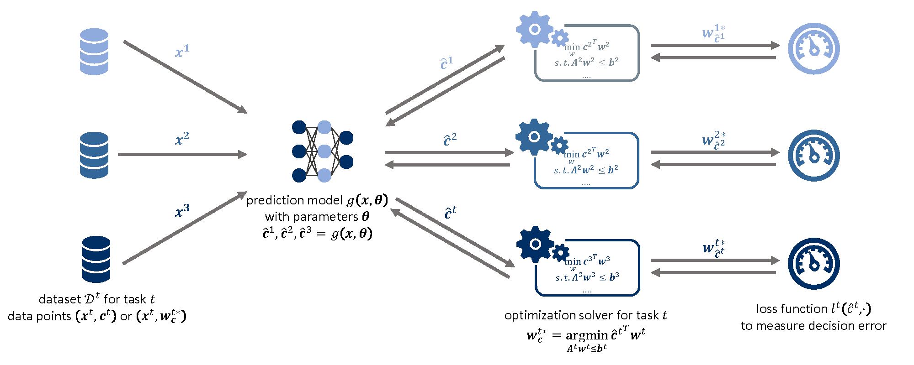
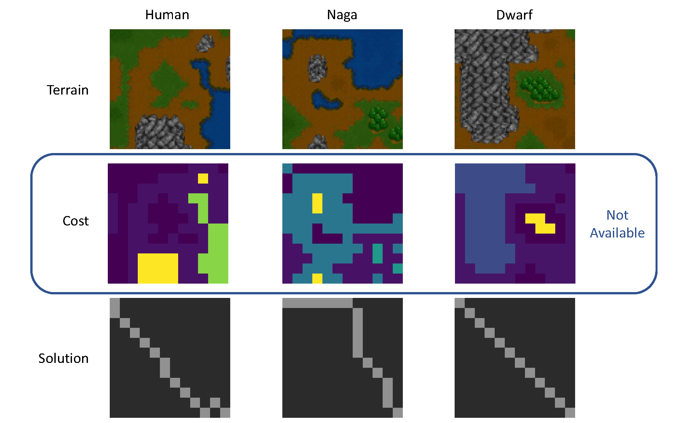
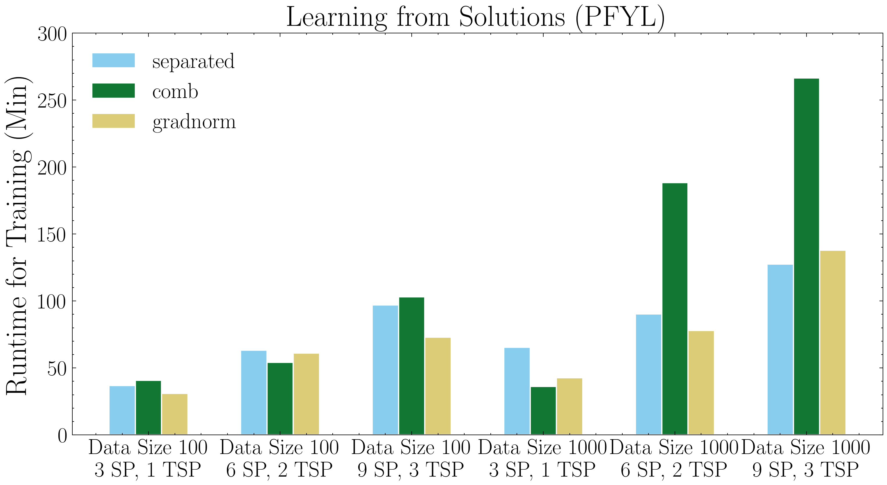
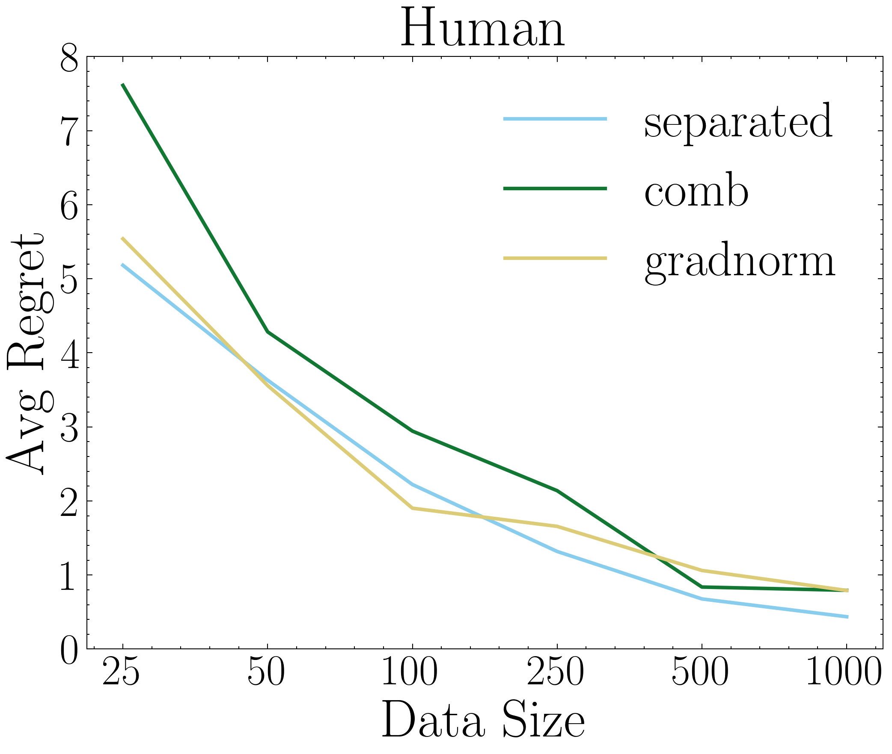
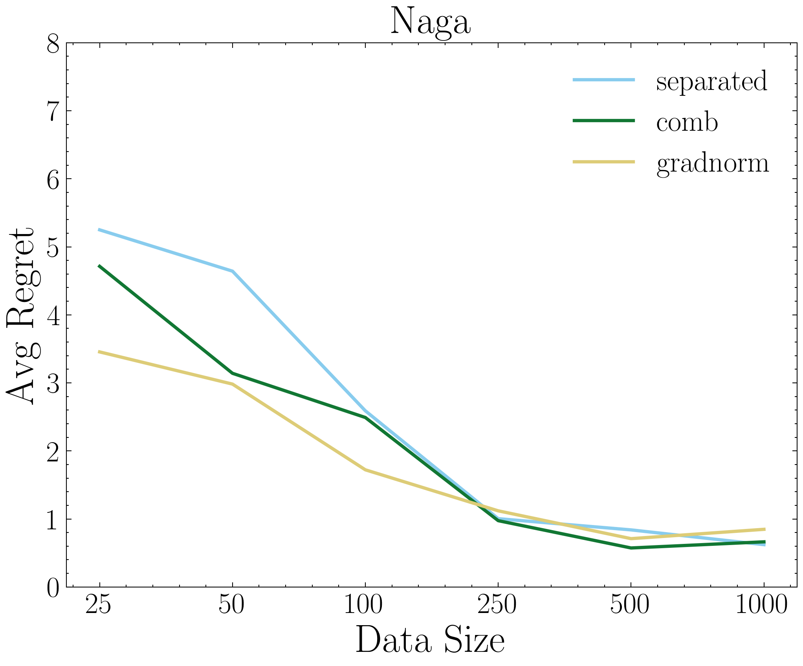
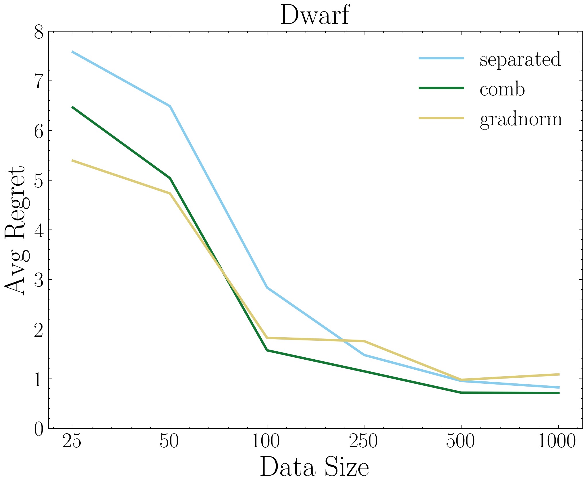
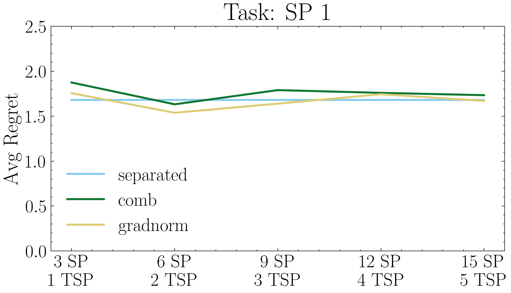
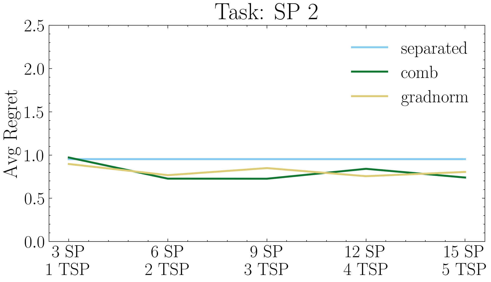
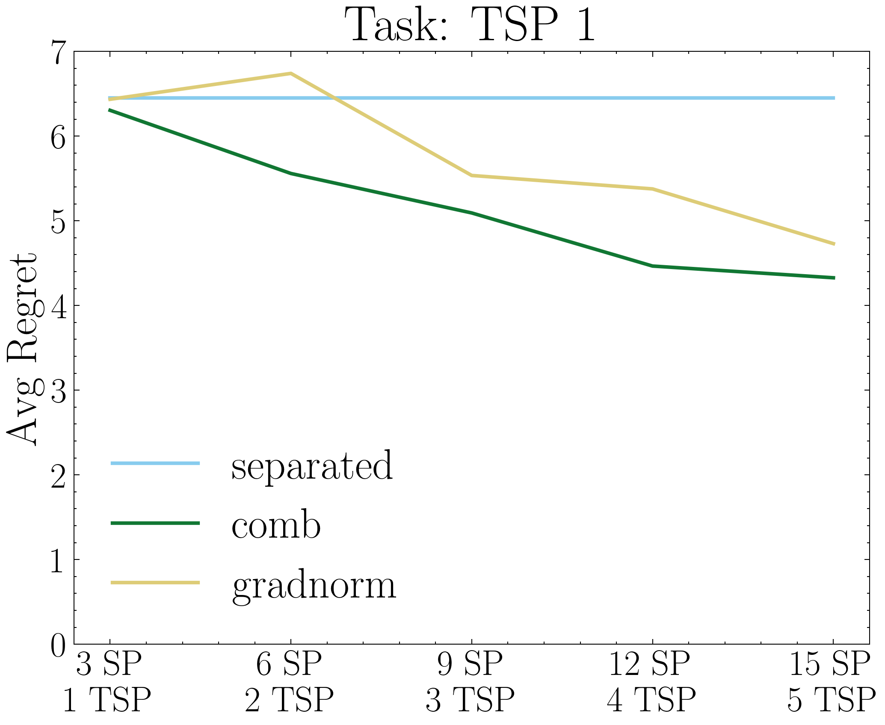
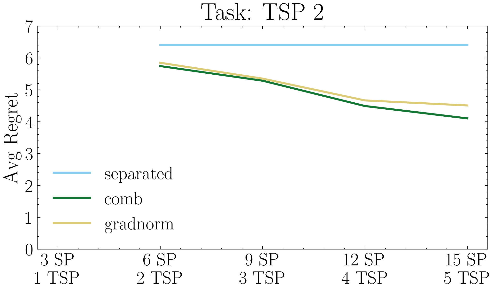

# Multi-Task Predict-then-Optimize
<p align="center"></p>

### Introduction
The predict-then-optimize framework arises in a wide variety of applications where the unknown cost coefficients of an optimization problem are first predicted based on contextual features and then used to solve the problem. In this work, we extend the predict-then-optimize framework to a multi-task setting: contextual features must be used to predict cost coefficients of multiple optimization problems simultaneously. We propose a set of methods for this setting that enable information sharing between tasks for improved learning, particularly in the small-data regime. Our experiments demonstrate that multi-task predict-then-optimize methods provide good tradeoffs in performance among different tasks, particularly with less training data and more tasks. 

### Publication

Bo Tang, and Elias B. Khalil. "Multi-task predict-then-optimize." arXiv preprint arXiv:2212.05403 (2022).

arXiv e-Print: [here](https://arxiv.org/abs/2212.05403)

#### Citation:

```
@article{tang2022multi,
  title={Multi-task predict-then-optimize},
  author={Tang, Bo and Khalil, Elias B},
  journal={arXiv preprint arXiv:2212.05403},
  year={2022}
}
```

### Dependencies

* [Python](https://www.python.org/)
* [NumPy](https://numpy.org/)
* [SciPy](https://scipy.org/)
* [Pathos](https://pathos.readthedocs.io/)
* [tqdm](https://tqdm.github.io/)
* [Pyomo](http://www.pyomo.org/)
* [Gurobi](https://www.gurobi.com/)
* [Scikit Learn](https://scikit-learn.org/)
* [PyTorch](http://pytorch.org/)
* [PyEPO](https://khalil-research.github.io/PyEPO)

### Datasets

* **Graph Routing:** Traveling salesperson problem dataset generated from PyEPO. ([Docs](https://khalil-research.github.io/PyEPO/build/html/content/examples/data.html))
* **Warcraft Terrain Images:** The Warcraft map shortest path dataset, which we modify the cost coefficients for different species. ([Download](https://drive.google.com/file/d/1lYPT7dEHtH0LaIFjigLOOkxUq4yi94fy))

<p align="center"></p>

### Multi-Task Training Strategies

| **Strategy**  | **Description**                                                                |
|---------------|--------------------------------------------------------------------------------|
| mse           | Two-stage method, training to minimize costs mean squared error                |
| separated     | Separated single-task learning for each task                                   |
| separated+mse | Separated single-task learning for each task with the costs mean squared error |
| comb          | A uniform combination of decision losses                                       |
| comb+mse      | A uniform combination of decision losses and the costs mean squared error      |
| gradnorm      | GradNorm for decision losses                                                   |
| gradnorm+mse  | GradNorm for decision losses and the costs mean squared error                  |

### Sample Code for Experiments

Sample code to run experiments and save results and figures is as follows:

#### Graph Routing

```bash
python pipeline.py --data 100 --n_sp 3 --n_tsp 1 --algo spo
```

##### Experiment Parameters:

###### Data Configuration
- **node:** Number of nodes in graph.
- **data:** Training data size.
- **feat:** Input feature size.
- **noise:** Noise half-width.

###### Task Configuration
- **n_sp:** Number of the shortest path tasks.
- **n_tsp:** Number of the traveling salesperson tasks.

###### Training Configuration
- **algo:** Training algorithm: spo for SPO+ and pfyl for PFYL.
- **iter:** Max training iterations.
- **batch:** Batch size.
- **lr:** Learning rate.
- **lr2:** Learning rate of loss weights (only for GradNorm).
- **alpha:** Hyperparameter of restoring force (only for GradNorm).
- **proc:** number of processor for optimization.

#### Warcraft Terrain Images

```bash
python pipeline_wsp.py --data 100 --algo spo
```

##### Experiment Parameters:

###### Data Configuration
- **k:** Size of grid network.
- **data:** Training data size.

###### Training Configuration
- **algo:** Training algorithm: spo for SPO+ and pfyl for PFYL.
- **iter:** Max training iterations.
- **batch:** Batch size.
- **lr:** Learning rate.
- **lr2:** Learning rate of loss weights (only for GradNorm).
- **alpha:** Hyperparameter of restoring force (only for GradNorm).
- **proc:** number of processor for optimization.

### Results

#### Performance Advantage

Multi-task predict-then-optimize has a performance advantage over single-task, especially with GradNorm.

##### Learning from Costs for Graph Routing

<p align="center">
  
  
</p>

##### Learning from Solutions for Graph Routing

<p align="center">
  
  
</p>

#### Efficiency Benefit

The use of GradNorm to adjust the weights dynamically allows for efficient model training as faster convergence is achieved.

<p align="center">
  
  
</p>

#### Learning under Data Scarcit

The multi-task predict-then-optimize framework is particularly effective in the small-data regime. The performance of the separated single-task model gradually improves and may even surpass multi-task learning as the amount of training data increases.

<p align="center">
  
  
  
</p>

#### Learning under Tasks Redundancy

The increasing related tasks improves the model performance, especially for complicated tasks such as TSP.

<p align="center">
  
  
</p>

<p align="center">
  
  
</p>

### Conclusion

We extend the end-to-end predict-then-optimize framework to multi-task learning, which jointly minimizes decision error for related optimization tasks. Our results demonstrate the benefits of this approach, including improved performance with less training data and the ability to handle multiple tasks simultaneously. Future work in this area could include the application of this method to real-world problems, as well as further exploration of techniques for multi-task learning, such as current and novel multi-task neural network architectures and gradient calibration methods.
